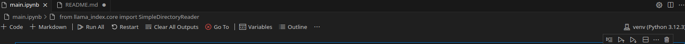

## Application to chat with your documents

### How to setup Python notebook in VS Code

1. Create a file `main.py`

2. Write a code 

```bash
print("Namaste")
```
3. Create a virtual enviroment

```bash
python3 -m venv venv
```

4. Activate the virtual environemt

```bash
source venv/bin/activate
```

5. Install the `ipykernel` within the virtual environment

```bash
pip install ipykernel
```

6. Add the virtual environment as a kernel

```bash
python -m ipykernel install --user --name=venv
```

7. Select the kernel in VS Code on the top right and select venv



### Installations

Install the dependencies from the `requirements.txt` file

```bash
pip install -r requirements.txt
```


### Setup your Project

- Create a `.env` file

- Add the following:

    ```
    GEMINI_API_KEY = <YOUR GEMINI API KEY>
    ```

- Run the kernels step-by-step

